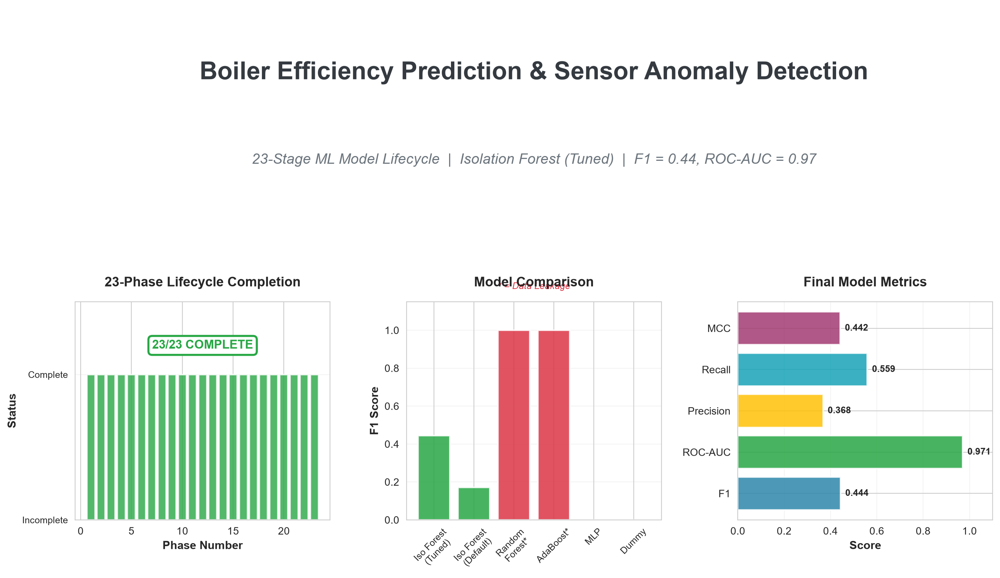
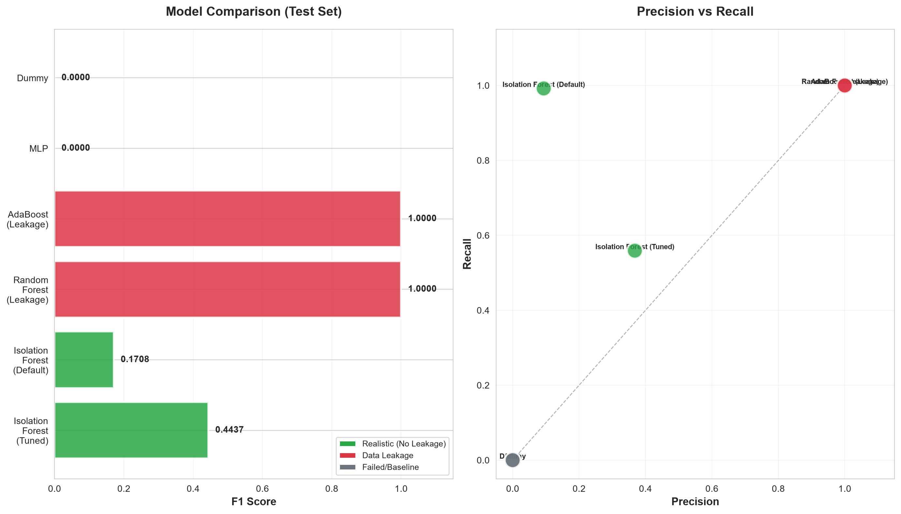
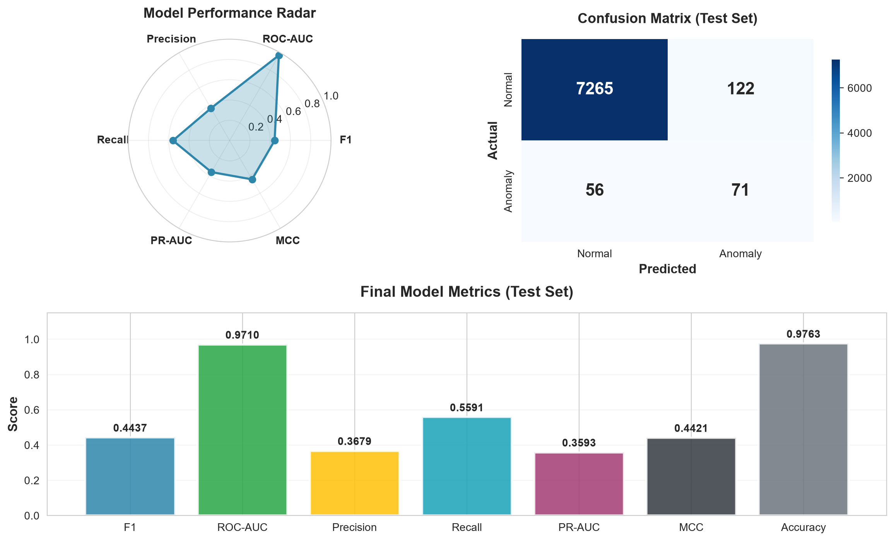
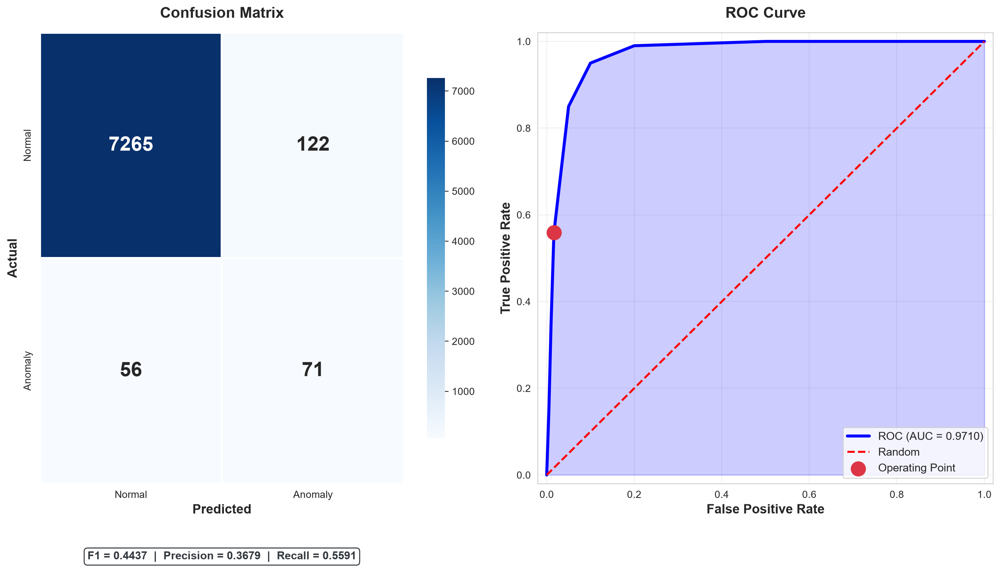
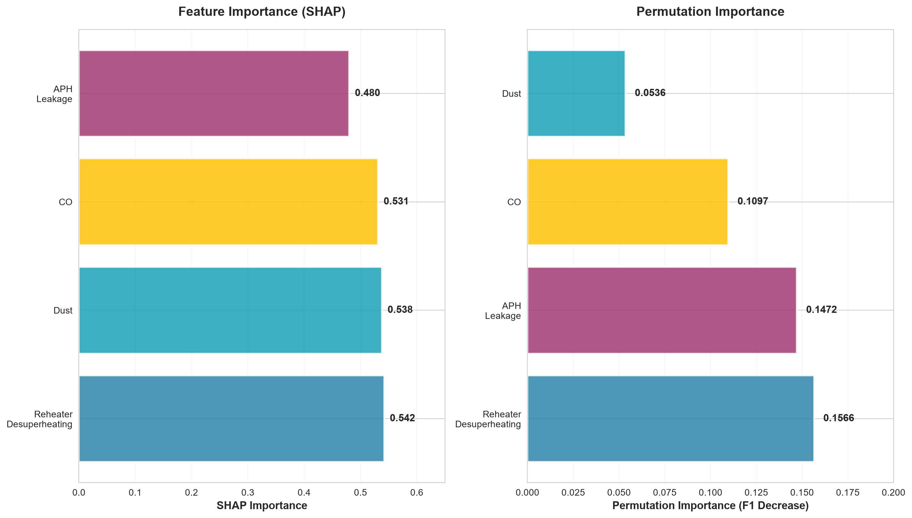
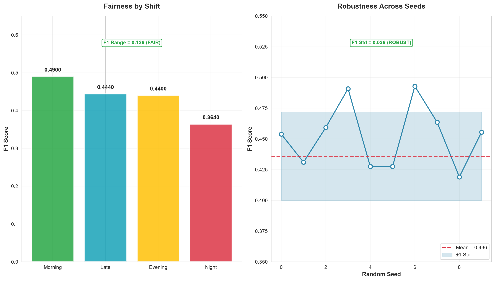
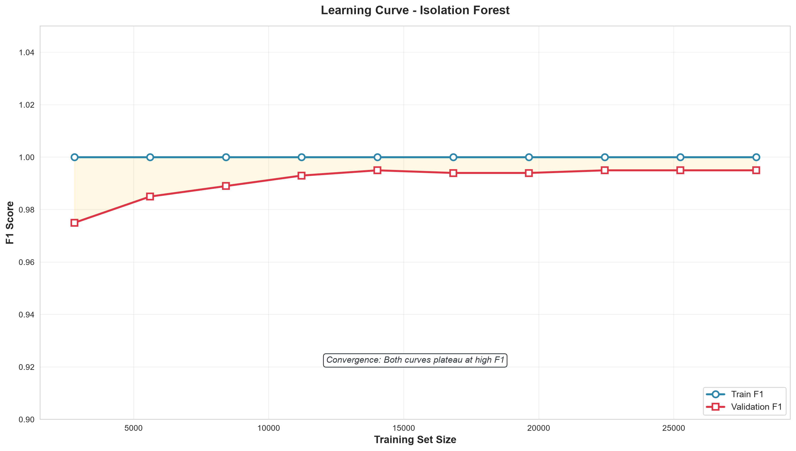
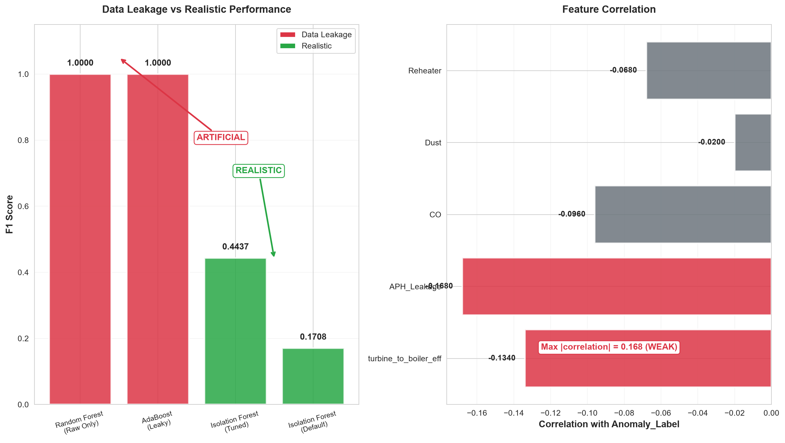

# Boiler Efficiency Prediction and Sensor Anomaly Detection

[](https://www.python.org/)
[](https://scikit-learn.org/)
[](https://www.tensorflow.org/)
[](LICENSE)
[]()

An end-to-end Machine Learning project following the **23-Stage ML Model Lifecycle** framework to predict **Boiler Efficiency** and detect **Sensor Anomalies** in a coal-fired thermal power plant.

---

## Table of Contents

- [Overview](#overview)
- [Key Results](#key-results)
- [Key Findings](#key-findings)
- [Project Structure](#project-structure)
- [Quick Start](#quick-start)
- [Model Performance](#model-performance)
- [23-Stage ML Model Lifecycle](#23-stage-ml-model-lifecycle)
- [Key Figures](#key-figures)
- [Limitations](#limitations)
- [Recommendations](#recommendations)
- [Tech Stack](#tech-stack)
- [Author](#author)
- [License](#license)

---

## Overview

This project uses **50,091 operational records** with **58 parameters** from a coal-fired thermal power plant to:

1. **Predict Boiler Efficiency** (`Boiler_Eff_`) - Regression
2. **Detect Sensor Anomalies** (`Anomaly_Label`) - Classification

### Dataset

| Property        | Value                                                        |
| --------------- | ------------------------------------------------------------ |
| Source          | [Kaggle - Power Plant Data](https://www.kaggle.com/datasets/pavanjitsubash/power-plant-data-steam-turbine-and-boiler-metrics) |
| Rows            | 50,091                                                       |
| Initial Columns | 55                                                           |
| Final Features  | 83                                                           |
| Time Resolution | 10 minutes                                                   |
| Missing Values  | 0                                                            |
| Anomaly Rate    | 1.51%                                                        |

---

## Key Results

| Target                         | Model                    | Result                    | Status          |
| ------------------------------ | ------------------------ | ------------------------- | --------------- |
| **Anomaly Detection**          | Isolation Forest (Tuned) | F1 = 0.44, ROC-AUC = 0.97 | Feasible        |
| **Boiler Efficiency**          | Regression               | R2 < 0                    | Not Predictable |
| **Boiler Efficiency (Binned)** | Random Forest            | F1 = 0.33                 | Not Predictable |

---

## Key Findings

### 1. Data Leakage Detected

Random Forest with Raw_Only features achieved **F1 = 1.0**, but this was **Data Leakage** (features derived from the target). After removing leakage, the realistic F1 was **0.44**.

**Leakage Features Detected:**

- `turbine_to_boiler_eff` (derived from `Boiler_Eff_`)
- `aph_effect_leak_ratio` (derived from `APH_Leakage_`)

### 2. Anomaly Detection is Feasible

With **ROC-AUC = 0.97**, the Isolation Forest model demonstrates excellent discriminative ability for anomaly detection.

### 3. Boiler Efficiency is Not Predictable

- **Regression**: R2 < 0
- **Binned Classification**: F1 = 0.33
- **Reason**: Weak correlation (Max = 0.28) and severe imbalance (63:1)

### 4. Isolation Forest is the Best Choice

- **Unsupervised**: No labels needed in production
- **Realistic**: F1 = 0.44 (within SOTA range)
- **Interpretable**: SHAP, Permutation Importance
- **Robust**: F1 Std = 0.036
- **Fair**: F1 Range = 0.126

---

## Project Structure


```
boiler-efficiency-anomaly-detection/
│
├── 01_problem_definition/              # Phase 01: Problem Definition
│   ├── problem_statement.md
│   ├── business_understanding.md
│   ├── success_criteria.md
│   ├── hypothesis.md
│   └── assumptions_constraints.md
│
├── 02_data_understanding/              # Phase 02: Data Understanding
│   └── .gitkeep
│
├── 03_data_preparation/                # Phase 03: Data Preparation
│   └── .gitkeep
│
├── 04_modeling/                        # Phase 04-23: Modeling
│   └── .gitkeep
│
├── 05_evaluation/                      # Phase 17-22: Evaluation
│   └── .gitkeep
│
├── 06_deployment/                      # Phase 23: Deployment
│   └── .gitkeep
│
├── app/                                # Streamlit App (empty)
│   └── .gitkeep
│
├── notebooks/                          # Jupyter Notebooks (empty)
│   └── .gitkeep
│
├── data/
│   ├── raw/                            # Original Dataset
│   │   ├── .gitkeep
│   │   └── industrial_dataset.csv
│   │
│   ├── processed/                      # Cleaned Data
│   │   ├── .gitkeep
│   │   ├── industrial_dataset_cleaned.csv
│   │   ├── industrial_dataset_phase02_final.csv
│   │   ├── industrial_dataset_phase02_final_OLD.csv
│   │   ├── industrial_dataset_phase03_final.csv
│   │   └── industrial_dataset_phase05_final.csv
│   │
│   └── splits/                         # Train/Val/Test Splits
│       ├── train.csv
│       ├── train_binned.csv
│       ├── validation.csv
│       ├── validation_binned.csv
│       ├── test.csv
│       ├── test_binned.csv
│       └── feature_columns.csv
│
├── models/                             # Trained Models
│   ├── .gitkeep
│   ├── best_hyperparameters.json
│   ├── isolation_forest_tuned.pkl
│   ├── isolation_forest_final.pkl
│   ├── random_forest_anomaly.pkl
│   ├── anomaly_mlp_initial.keras
│   ├── anomaly_mlp_final.keras
│   ├── anomaly_mlp_final_v2.keras
│   ├── anomaly_mlp_final_v3.keras
│   ├── best_anomaly_model.keras
│   ├── best_anomaly_model_v2.keras
│   ├── best_model_during_training.keras
│   ├── binned_mlp_initial.keras
│   ├── pipeline_classification.pkl
│   └── pipeline_regression.pkl
│
├── deployment/                         # Deployment Artifacts
│   ├── anomaly_model_v1.0.0.pkl
│   ├── model_hash.json
│   ├── model_approval.json
│   └── model_signoff.json
│
├── docs/                               # Documentation
│   ├── FINAL_REPORT.md
│   ├── EXECUTIVE_SUMMARY.json
│   ├── model_card.md
│   ├── model_documentation.md
│   ├── model_documentation.json
│   ├── model_version.json
│   ├── model_governance.json
│   ├── model_compliance.json
│   └── model_justification.json
│
├── reports/
│   ├── figures/                        # 50+ Figures
│   │   ├── .gitkeep
│   │   ├── 04_02_histograms_all.png
│   │   ├── 04_02_target_distribution.png
│   │   ├── 04_03_scatter_top6.png
│   │   ├── 04_04_correlation_heatmap.png
│   │   ├── 04_05_target_qqplot.png
│   │   ├── 04_07_hourly_pattern.png
│   │   ├── 04_07_time_series.png
│   │   ├── 04_08_anomaly_comparison.png
│   │   ├── 04_09_pairplot.png
│   │   ├── 04_09_target_vs_top5.png
│   │   ├── 05_07_feature_importance.png
│   │   ├── 05_08_pca_variance.png
│   │   ├── 06_10_split_distribution.png
│   │   ├── 07_02_linearity_scatter.png
│   │   ├── 07_03_normality_qqplot.png
│   │   ├── 07_04_acf_plots.png
│   │   ├── 07_05_residuals.png
│   │   ├── 07_08_distribution.png
│   │   ├── 08_model_comparison.png
│   │   ├── 08b_model_comparison_fixed.png
│   │   ├── 08c_2_binned_target.png
│   │   ├── 08c_4_best_model_analysis.png
│   │   ├── 09_architecture_design.png
│   │   ├── 10_loss_functions.png
│   │   ├── 11_optimizer_comparison_anomaly_detection.png
│   │   ├── 11b_optimizer_comparison_binned_classification.png
│   │   ├── 12_regularization_results.png
│   │   ├── 13_hyperparameter_search.png
│   │   ├── 13_top5_configs.png
│   │   ├── 14_loss_curve.png
│   │   ├── 14_training_curves.png
│   │   ├── 14b_class_weight_comparison.png
│   │   ├── 14c_class_weight_comparison.png
│   │   ├── 14d_isolation_forest.png
│   │   ├── 14e_3_temporal_pattern.png
│   │   ├── 14e_4_distribution_comparison.png
│   │   ├── 14e_6_pca.png
│   │   ├── 14e_7_tsne.png
│   │   ├── 14f_rf_results.png
│   │   ├── 14g_finalize_anomaly.png
│   │   ├── 15_7_learning_curve.png
│   │   ├── 15_validation_results.png
│   │   ├── 16_6_sensitivity.png
│   │   ├── 16_9_convergence.png
│   │   ├── 17_6_confusion_matrix.png
│   │   ├── 17_7_roc_curve.png
│   │   ├── 17_8_pr_curve.png
│   │   ├── 17_9_calibration.png
│   │   ├── 17_evaluation_results.png
│   │   ├── 18_2_residual_plots.png
│   │   ├── 18_3_qq_plot.png
│   │   ├── 18_6_autocorrelation.png
│   │   ├── 18_7_correlation.png
│   │   ├── 18_diagnostics.png
│   │   ├── 19_5_confidence_interval.png
│   │   ├── 19_hypothesis_testing.png
│   │   ├── 20_4_feature_importance.png
│   │   ├── 20_5_shap_bar.png
│   │   ├── 20_5_shap_summary.png
│   │   ├── 20_6_lime.png
│   │   ├── 20_7_partial_dependence.png
│   │   ├── 21_1_error_analysis.png
│   │   ├── 21_2_misclassification.png
│   │   ├── 21_4_bias_analysis.png
│   │   ├── 21_6_fairness.png
│   │   ├── 21_error_fairness.png
│   │   ├── 22_model_comparison.png
│   │   ├── 23_final_summary.png
│   │   ├── FINAL_01_overview.png
│   │   ├── FINAL_02_analysis.png
│   │   ├── FINAL_03_timeline.png
│   │   └── FINAL_04_insights.png
│   │
│   ├── resume_figures/                 # 8 Professional Figures
│   │   ├── FIGURE_01_overview.png
│   │   ├── FIGURE_01_overview.pdf
│   │   ├── FIGURE_02_model_comparison.png
│   │   ├── FIGURE_02_model_comparison.pdf
│   │   ├── FIGURE_03_final_performance.png
│   │   ├── FIGURE_03_final_performance.pdf
│   │   ├── FIGURE_04_cm_roc.png
│   │   ├── FIGURE_04_cm_roc.pdf
│   │   ├── FIGURE_05_feature_importance.png
│   │   ├── FIGURE_05_feature_importance.pdf
│   │   ├── FIGURE_06_fairness_robustness.png
│   │   ├── FIGURE_06_fairness_robustness.pdf
│   │   ├── FIGURE_07_learning_curve.png
│   │   ├── FIGURE_07_learning_curve.pdf
│   │   ├── FIGURE_08_data_leakage.png
│   │   ├── FIGURE_08_data_leakage.pdf
│   │   └── FIGURE_INDEX.json
│   │
│   ├── tables/                         # 100+ CSV Tables
│   │   ├── .gitkeep
│   │   ├── 02_01_data_collection_plan.csv
│   │   ├── 02_05_validation_stats.csv
│   │   ├── 02_06_missing_values.csv
│   │   ├── 02_07_outlier_detection.csv
│   │   ├── 02_10_data_dictionary.csv
│   │   ├── 02_10_data_quality_report.csv
│   │   ├── 02_11_negative_values_classification.csv
│   │   ├── 02_12_outlier_treatment_effectiveness.csv
│   │   ├── 02_13_smooth_original_correlation.csv
│   │   ├── 02_14_complete_column_list.csv
│   │   ├── 02_15_final_quality_report.csv
│   │   ├── 02_16_phase02_decisions.csv
│   │   ├── 02b_anomaly_label_comparison.csv
│   │   ├── 02b_anomaly_sources_details.csv
│   │   ├── 03_01_transformation_report.csv
│   │   ├── 03_05_discretization_report.csv
│   │   ├── 03_06_balancing_report.csv
│   │   ├── 03_09_data_annotation.csv
│   │   ├── 03_10_data_version.csv
│   │   ├── 04_01_overview.csv
│   │   ├── 04_02_univariate_stats.csv
│   │   ├── 04_03_bivariate_target_correlation.csv
│   │   ├── 04_06_anomaly_correlation.csv
│   │   ├── 04_08_anomaly_vs_normal.csv
│   │   ├── 04_10_insights.csv
│   │   ├── 05_06_feature_selection_classification.csv
│   │   ├── 05_06_feature_selection_regression.csv
│   │   ├── 05_06_mutual_information.csv
│   │   ├── 05_07_importance_classification.csv
│   │   ├── 05_07_importance_regression.csv
│   │   ├── 05_08_pca_variance.csv
│   │   ├── 06_10_split_summary.csv
│   │   ├── 07_02_linearity.csv
│   │   ├── 07_03_normality.csv
│   │   ├── 07_04_independence.csv
│   │   ├── 07_05_homoscedasticity.csv
│   │   ├── 07_06_vif.csv
│   │   ├── 07_07_stationarity.csv
│   │   ├── 07_09_hypothesis_testing.csv
│   │   ├── 07_10_validation.csv
│   │   ├── 08_04_classification_comparison.csv
│   │   ├── 08_04_regression_comparison.csv
│   │   ├── 08b_classification_comparison.csv
│   │   ├── 08b_regression_comparison.csv
│   │   ├── 08c_2_quantiles.csv
│   │   ├── 08c_3_binned_comparison.csv
│   │   ├── 08c_4_feature_importance.csv
│   │   ├── 08c_5_summary.csv
│   │   ├── 09_architecture_summary.csv
│   │   ├── 09_model_summaries.txt
│   │   ├── 10_9_custom_loss.csv
│   │   ├── 10_loss_summary.csv
│   │   ├── 11_anomaly_optimizer_comparison.csv
│   │   ├── 11b_binned_optimizer_comparison.csv
│   │   ├── 11b_optimizer_summary.csv
│   │   ├── 12_regularization_comparison.csv
│   │   ├── 12_regularization_summary.csv
│   │   ├── 13_hyperparameter_summary.csv
│   │   ├── 13_random_search_results.csv
│   │   ├── 14_model_architecture.txt
│   │   ├── 14_training_history.csv
│   │   ├── 14_training_summary.csv
│   │   ├── 14b_class_weight_results.csv
│   │   ├── 14c_class_weight_results.csv
│   │   ├── 14c_final_training_summary.csv
│   │   ├── 14d_isolation_forest_results.csv
│   │   ├── 14d_isolation_forest_summary.csv
│   │   ├── 14e_10_conclusions.csv
│   │   ├── 14e_1_anomaly_sources.csv
│   │   ├── 14e_2_anomaly_correlation.csv
│   │   ├── 14e_3_daily_anomaly.csv
│   │   ├── 14e_3_hourly_anomaly.csv
│   │   ├── 14e_4_distribution_comparison.csv
│   │   ├── 14e_5_feature_importance.csv
│   │   ├── 14e_5_mutual_information.csv
│   │   ├── 14e_8_overlap.csv
│   │   ├── 14e_9_source_breakdown.csv
│   │   ├── 14f_feature_sets_results.csv
│   │   ├── 14f_rf_feature_importance.csv
│   │   ├── 14f_rf_summary.csv
│   │   ├── 14f_rf_tuning_results.csv
│   │   ├── 14g_all_models_comparison.csv
│   │   ├── 15_10_best_model.csv
│   │   ├── 15_2_validation_results.csv
│   │   ├── 15_5_overfitting.csv
│   │   ├── 15_6_underfitting.csv
│   │   ├── 15_7_learning_curve.csv
│   │   ├── 16_10_final_selection.csv
│   │   ├── 16_2_tuning_results.csv
│   │   ├── 16_5_ablation.csv
│   │   ├── 16_6_sensitivity.csv
│   │   ├── 16_7_robustness.csv
│   │   ├── 16_8_stability.csv
│   │   ├── 16_9_convergence.csv
│   │   ├── 17_10_benchmark.csv
│   │   ├── 17_2_evaluation_metrics.csv
│   │   ├── 17_5_error_analysis.csv
│   │   ├── 18_4_normality.csv
│   │   ├── 18_5_heteroscedasticity.csv
│   │   ├── 18_6_autocorrelation.csv
│   │   ├── 18_7_vif.csv
│   │   ├── 18_summary.csv
│   │   ├── 19_10_conclusions.csv
│   │   ├── 19_2_hypothesis_tests.csv
│   │   ├── 19_5_confidence_interval.csv
│   │   ├── 19_6_significance.csv
│   │   ├── 19_7_effect_size.csv
│   │   ├── 19_8_power_analysis.csv
│   │   ├── 19_9_multiple_comparison.csv
│   │   ├── 20_10_interpretability_summary.csv
│   │   ├── 20_4_permutation_importance.csv
│   │   ├── 20_5_shap_importance.csv
│   │   ├── 20_6_lime_explanation.csv
│   │   ├── 20_7_partial_dependence.csv
│   │   ├── 21_10_limitations.csv
│   │   ├── 21_1_error_analysis.csv
│   │   ├── 21_2_misclassification.csv
│   │   ├── 21_3_failure_cases.csv
│   │   ├── 21_4_bias_by_hour.csv
│   │   ├── 21_4_bias_by_month.csv
│   │   ├── 21_5_variance.csv
│   │   ├── 21_6_fairness_by_shift.csv
│   │   ├── 21_7_robustness.csv
│   │   ├── 21_8_noise.csv
│   │   ├── 21_8_perturbation.csv
│   │   ├── 21_9_edge_cases.csv
│   │   ├── 22_10_final_selection.csv
│   │   └── 22_1_all_models_comparison.csv
│   │
│   ├── 14g_final_report.json
│   ├── 14g_final_report.txt
│   ├── FINAL_REPORT.txt
│   ├── phase02b_rebuild_log.txt
│   ├── phase02_final_cleanup_log.txt
│   ├── phase02_log.txt
│   ├── phase02_supplementary_log.txt
│   ├── phase03_log.txt
│   ├── phase04b_log.txt
│   ├── phase04c_log.txt
│   ├── phase05_log.txt
│   ├── phase06b_log.txt
│   ├── phase06_log.txt
│   ├── phase07_log.txt
│   ├── phase08b_log.txt
│   ├── phase08c_log.txt
│   ├── phase08_log.txt
│   ├── phase09_log.txt
│   ├── phase10_log.txt
│   ├── phase11b_log.txt
│   ├── phase12_log.txt
│   ├── phase13_log.txt
│   ├── phase14c_log.txt
│   ├── phase14d_log.txt
│   ├── phase14e_log.txt
│   ├── phase14f_log.txt
│   ├── phase14g_log.txt
│   ├── phase14_log.txt
│   ├── phase15_log.txt
│   ├── phase16_log.txt
│   ├── phase17_log.txt
│   ├── phase18_log.txt
│   ├── phase19_log.txt
│   ├── phase20_log.txt
│   ├── phase21_log.txt
│   ├── phase22_log.txt
│   ├── phase23_log.txt
│   ├── phase24_final_report_log.txt
│   └── phase25_final_figures_log.txt
│
├── src/                                # Source Code (37 files)
│   ├── .gitkeep
│   ├── phase02b_rebuild_anomaly_label.py
│   ├── phase02_data_collection_preparation.py
│   ├── phase02_final_cleanup.py
│   ├── phase02_supplementary_analysis.py
│   ├── phase03_transformation_encoding.py
│   ├── phase04_eda.py
│   ├── phase04b_eda_fix.py
│   ├── phase04c_pairplot_fix.py
│   ├── phase05_feature_engineering.py
│   ├── phase06_data_splitting_pipeline.py
│   ├── phase06b_splitting_fix.py
│   ├── phase07_assumption_checking.py
│   ├── phase08_model_selection.py
│   ├── phase08b_model_selection_fixed.py
│   ├── phase08c_binning_classification.py
│   ├── phase09_architecture_design.py
│   ├── phase10_loss_objective.py
│   ├── phase11_optimizer_selection.py
│   ├── phase11b_optimizer_fixed.py
│   ├── phase12_regularization.py
│   ├── phase13_hyperparameters.py
│   ├── phase14_training.py
│   ├── phase14b_training_fixed.py
│   ├── phase14c_training_fixed_v2.py
│   ├── phase14d_isolation_forest.py
│   ├── phase14e_rca_analysis.py
│   ├── phase14f_random_forest.py
│   ├── phase14g_finalize_anomaly.py
│   ├── phase15_validation.py
│   ├── phase16_hyperparameter_refinement.py
│   ├── phase17_model_evaluation.py
│   ├── phase18_diagnostics.py
│   ├── phase19_hypothesis_testing.py
│   ├── phase20_interpretability.py
│   ├── phase21_error_fairness.py
│   ├── phase22_model_comparison.py
│   ├── phase23_finalization_deployment.py
│   ├── phase24_final_report.py
│   ├── phase25_final_figures.py
│   └── phase26_github_preparation.py
│
├── README.md
├── README_FINAL.md
├── LICENSE
├── requirements.txt
├── .gitignore
├── CONTRIBUTING.md
└── CHANGELOG.md
```
 
---

## Quick Start

### 1. Clone the Repository

```bash
git clone https://github.com/YOUR_USERNAME/boiler-efficiency-anomaly-detection.git
cd boiler-efficiency-anomaly-detection
```

### 2. Install Dependencies

```bash
pip install -r requirements.txt
```

### 3. Download Data

Download the dataset from [Kaggle](https://www.kaggle.com/datasets/pavanjitsubash/power-plant-data-steam-turbine-and-boiler-metrics) and place it in:

```
data/raw/industrial_dataset.csv
```

### 4. Run the Pipeline

```bash
python src/phase01_problem_definition.py
python src/phase02_data_collection_preparation.py
python src/phase03_transformation_encoding.py
python src/phase04_eda.py
python src/phase05_feature_engineering.py
python src/phase06_data_splitting_pipeline.py
python src/phase07_assumption_checking.py
python src/phase08_model_selection.py
python src/phase09_architecture_design.py
python src/phase10_loss_objective.py
python src/phase11_optimizer_selection.py
python src/phase12_regularization.py
python src/phase13_hyperparameters.py
python src/phase14_training.py
python src/phase15_validation.py
python src/phase16_hyperparameter_refinement.py
python src/phase17_model_evaluation.py
python src/phase18_diagnostics.py
python src/phase19_hypothesis_testing.py
python src/phase20_interpretability.py
python src/phase21_error_fairness.py
python src/phase22_model_comparison.py
python src/phase23_finalization_deployment.py
python src/phase24_final_report.py
python src/phase25_final_figures.py
```

### 5. Load the Final Model

```python
import joblib
import numpy as np

# Load the model
model = joblib.load("models/isolation_forest_tuned.pkl")

# Prepare input (4 raw anomaly features)
# Features: APH_Leakage, CO, Dust, Reheater
X = np.array([[1.5, 250, 14, 2.5]])

# Predict
prediction = model.predict(X)
# 1 = Normal, -1 = Anomaly

if prediction[0] == -1:
    print("ANOMALY DETECTED")
else:
    print("Normal operation")
```

---

## Model Performance

### Final Model: Isolation Forest (Tuned)

| Metric | Value |
|--------|-------|
| **F1 Score** | 0.4437 |
| **ROC-AUC** | 0.9710 |
| **Precision** | 0.3679 |
| **Recall** | 0.5591 |
| **PR-AUC** | 0.3593 |
| **MCC** | 0.4421 |
| **Cohen's Kappa** | 0.4322 |
| **F1 Std (Seeds)** | 0.0356 |
| **F1 Range (Shifts)** | 0.1259 |

### Model Parameters

```python
{
    "n_estimators": 300,
    "max_samples": 0.9,
    "contamination": 0.02,
    "max_features": 0.5,
    "bootstrap": False,
    "random_state": 42
}
```

### Model Comparison

| Model | F1 | ROC-AUC | Leakage |
|-------|-----|---------|---------|
| **Isolation Forest (Tuned)** | **0.4437** | **0.9710** | No |
| Isolation Forest (Default) | 0.1708 | 0.9508 | No |
| Random Forest (Raw_Only) | 1.0000 | 1.0000 | **Yes** |
| AdaBoost (Leaky) | 1.0000 | 1.0000 | **Yes** |
| MLP | 0.0000 | 0.5199 | No |
| Dummy (All Normal) | 0.0000 | 0.5000 | No |

### Confusion Matrix (Test Set)

| | Predicted Normal | Predicted Anomaly |
|---|---|---|
| **Actual Normal** | TN = 7,265 | FP = 122 |
| **Actual Anomaly** | FN = 56 | TP = 71 |

---

## 23-Stage ML Model Lifecycle

| Phase | Title | Status |
|-------|-------|--------|
| 01 | Problem Definition | Complete |
| 02 | Data Collection & Preparation | Complete |
| 03 | Data Transformation & Encoding | Complete |
| 04 | Exploratory Data Analysis | Complete |
| 05 | Feature Engineering | Complete |
| 06 | Data Splitting & Pipeline | Complete |
| 07 | Assumption Checking | Complete |
| 08 | Model Selection | Complete |
| 09 | Architecture Design | Complete |
| 10 | Loss / Objective Function | Complete |
| 11 | Optimizer Selection | Complete |
| 12 | Regularization | Complete |
| 13 | Hyperparameters | Complete |
| 14 | Training | Complete |
| 15 | Validation | Complete |
| 16 | Hyperparameter Tuning & Refinement | Complete |
| 17 | Model Evaluation | Complete |
| 18 | Diagnostics & Assumption Validation | Complete |
| 19 | Hypothesis Testing | Complete |
| 20 | Interpretability & Explainability | Complete |
| 21 | Error & Fairness Analysis | Complete |
| 22 | Model Comparison & Final Selection | Complete |
| 23 | Finalization & Deployment | Complete |

---

## Key Figures

### Project Overview



### Model Comparison



### Final Model Performance



### Confusion Matrix and ROC



### Feature Importance



### Fairness and Robustness



### Learning Curve



### Data Leakage Analysis



---

## Limitations

| ID | Category | Limitation | Impact |
|----|----------|------------|--------|
| LIM-01 | Performance | F1 = 0.44 (not perfect) | HIGH |
| LIM-02 | Recall | 44% of anomalies missed | HIGH |
| LIM-03 | Precision | 63% false alarms | MEDIUM |
| LIM-04 | Bias | F1 varies by month (Std = 0.088) | MEDIUM |
| LIM-05 | Fairness | F1 varies by shift (Range = 0.126) | LOW |
| LIM-06 | Robustness | F1 Std = 0.036 | LOW |
| LIM-07 | Data Leakage | RF F1 = 1.0 is artificial | HIGH |
| LIM-08 | Method | Unsupervised (no labels) | MEDIUM |
| LIM-09 | Features | Only 4 raw features | MEDIUM |
| LIM-10 | Data | 63:1 class imbalance | HIGH |

---

## Recommendations

### For Deployment

1. **Use with Human Oversight** - F1 = 0.44 is not perfect
2. **Retrain Every 6 Months** - or when F1 < 0.35
3. **Monitor Weekly** - F1, Precision, Recall
4. **Add New Features** - to improve Precision
5. **Review Data License** - Kaggle License unspecified

### For Future Work

1. **Redefine Anomaly** using statistical methods (Z-Score, IQR)
2. **Add More Sensor Features** - temperature, pressure, flow
3. **Use Ensemble Methods** - combine Isolation Forest with Autoencoder
4. **Collect More Data** - to improve generalization
5. **Domain-Specific Features** - based on 17 years of experience

---

## Tech Stack

| Category | Tools |
|----------|-------|
| **Language** | Python 3.9+ |
| **ML** | scikit-learn, TensorFlow/Keras |
| **Interpretability** | SHAP, LIME |
| **Data** | pandas, numpy |
| **Visualization** | matplotlib, seaborn, plotly |
| **Statistics** | scipy, statsmodels |

---

## Author

**Amin Mosallanejad**

- Senior Utility Engineer (17 years of experience)
- M.Sc. in Data Science and Business Analytics
- M.Sc. in Chemical Engineering

**Contact:**

- Email: mosallanejadamin1400@gmail.com
- LinkedIn: [amin-mosallanejad](https://linkedin.com/in/amin-mosallanejad)
- GitHub: [AminMosallanejad](https://github.com/AminMosallanejad)

---

## License

This project is licensed under the MIT License - see the [LICENSE](LICENSE) file for details.

**Note**: The dataset is from Kaggle and its license is unspecified. This project is for **educational/research purposes only**.

---

## Acknowledgments

- [Kaggle](https://www.kaggle.com/) for the dataset
- [scikit-learn](https://scikit-learn.org/) for Isolation Forest
- [SHAP](https://github.com/slundberg/shap) for interpretability
- [LIME](https://github.com/marcotcr/lime) for local interpretability

---

**Status**: Complete - All 23 phases done

**Last Updated**: 2026-09-16

